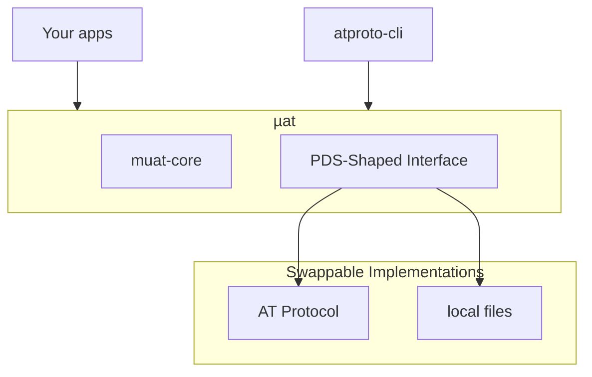

# µat

µat is a Rust toolkit for working with [AT Protocol](https://atproto.com/specs/atp) or AT/PDS-shaped filesystem stores, without requiring a full network PDS.

> An “AT/PDS-shaped” store is one that preserves similar append-only record, firehose, and projection semantics as a network PDS, without implementing federation or hosting.

- `muat-xrpc`: A minimal client for AT Protocol (ATproto) Personal Data Servers. (PDS)
  - you can use this to build your own AT based apps
- `muat-file`: An "AT/PDS shaped" local filesystem store.
  - you can use this to test AT based apps, or build local apps with AT semantics.
- `atproto-cli`: A command line utility for interrogating PDS shaped (file or xrpc) stores.
  - you can use this to interrogate AT PDS servers, local AT/PDS-shaped stores, or post to [Bluesky](https://bsky.app).

## Overview

ATproto has been described as a "[social filesystem](https://news.ycombinator.com/item?id=46665839)" and has some really interesting attributes:

- it can be distributed
- it's event driven and built around projections (the firehose)
- it's logically immutable (i.e. until an admin or a lawyer gets involved)

Records themselves are typed through json-schema like "[lexicons](https://atproto.com/specs/lexicon)" and you
can pretty much store anything in a PDS. Storing immutable JSON records and projecting them into a firehose
makes for a nicely legible on-disk database format suitable for lots of different kinds of applications.

That said, existing PDS implementations are pretty heavyweight. µat addresses this by providing a kind of "embedded PDS"
that provides the same semantics as a real PDS; but just writes to the filesystem. It also provides a miniature XRPC client, as both a lightweight client and a conformance check the trait surface.

If you want to talk _real_ AT in Rust; you might be better off using [ATrium](https://github.com/atrium-rs/atrium).

### Crates

| Crate         | Description                                                   | Docs                                   |
| ------------- | ------------------------------------------------------------- | -------------------------------------- |
| `muat-core`   | Core types, errors, and traits (`Pds`, `Session`, `Firehose`) | [README](crates/muat-core/README.md)   |
| `muat-xrpc`   | XRPC-backed PDS implementation for real servers               | [README](crates/muat-xrpc/README.md)   |
| `muat-file`   | File-backed PDS implementation for local apps & testing       | [README](crates/muat-file/README.md)   |
| `atproto-cli` | CLI tool for PDS exploration and debugging                    | [README](crates/atproto-cli/README.md) |

## Quick Start

### Installation

```bash
# Build from source
cargo build --release

# Install the CLI
cargo install --path crates/atproto-cli
```

### CLI Usage

```bash
# Check version
atproto --version

# Login to a PDS
atproto pds login --identifier alice.bsky.social --password your-app-password

# Check your session
atproto pds whoami

# Create a record
# this will inject and overwrite `$type` to match the passed type
echo '{"$type":"i am the wrong type","text":"Hello from muat!","createdAt":"2026-02-03T12:00:00Z"}' \
| atproto pds create-record app.bsky.feed.post --type app.bsky.feed.post --json -

# List records in a collection
atproto pds list-records app.bsky.feed.post

# Get a specific record
atproto pds get-record at://did:plc:xxx/app.bsky.feed.post/yyy

# Delete a record
atproto pds delete-record at://did:plc:xxx/org.example.record/yyy

# Subscribe to the firehose
atproto pds subscribe
```

### Querying local stores with file:// PDS

```bash
# Create a local account
atproto pds create-account alice.local --password mypass --pds file://./pds

# Remove a local account
atproto pds remove-account did:plc:xxx --password mypass --pds file://./pds
```

### Library Usage

```rust
use muat_core::traits::{Pds, Session};
use muat_core::{Credentials, Nsid, PdsUrl};
use muat_xrpc::XrpcPds;

#[tokio::main]
async fn main() -> Result<(), muat_core::Error> {
    // Connect to a PDS
    let pds_url = PdsUrl::new("https://bsky.social")?;
    let pds = XrpcPds::new(pds_url);
    let credentials = Credentials::new("alice.bsky.social", "app-password");

    // Create a session
    let session = pds.login(credentials).await?;
    println!("Logged in as: {}", session.did());

    // List records
    let collection = Nsid::new("app.bsky.feed.post")?;
    let records = session
        .list_records(session.did(), &collection, Some(10), None)
        .await?;

    for record in records.records {
        println!("{}: {:?}", record.uri, record.value);
    }

    Ok(())
}
```

## Architecture



## Development

### Prerequisites

- Rust 2024 edition
- Cargo

### Building

```bash
# Check all crates
cargo check --workspace

# Run tests
cargo test --workspace

# Build release
cargo build --release --workspace
```

## CI/CD & Releases

### CI Pipeline

The CI pipeline runs on every push and pull request:

1. **fmt** - Code formatting check
2. **clippy** - Lints with warnings as errors
3. **unit_tests** - Unit tests with mock PDS
4. **integration_tests** - Real PDS tests (requires secrets)

### Builds from Main

CI can produce release-style binaries from `main` for manual testing:

- Triggered via workflow dispatch with `build_main: true`
- Builds for Linux x86_64 and Windows x86_64
- Artifacts available for 14 days

### Creating Releases

Releases are created by pushing an annotated tag:

```bash
git tag -a v0.2.0 -m "v0.2.0"
git push origin v0.2.0
```

This triggers the release workflow which:

- Builds binaries for Linux and Windows
- Generates SHA256 checksums
- Creates a GitHub Release with auto-generated notes
- Attaches all artifacts

### Supported Platforms

| Platform       | Build | Tests              |
| -------------- | ----- | ------------------ |
| Linux x86_64   | Yes   | Unit + Integration |
| Windows x86_64 | Yes   | Unit only          |
